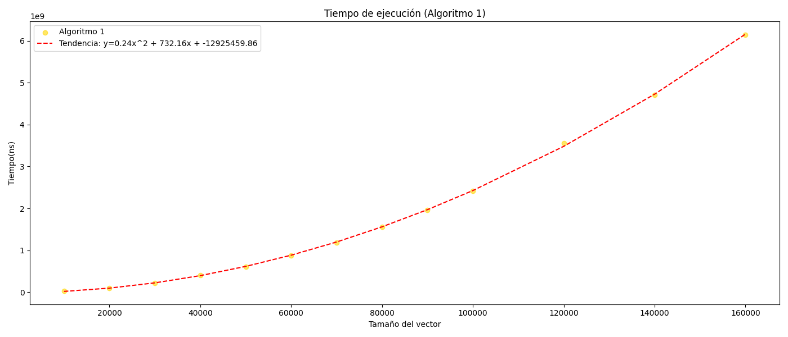
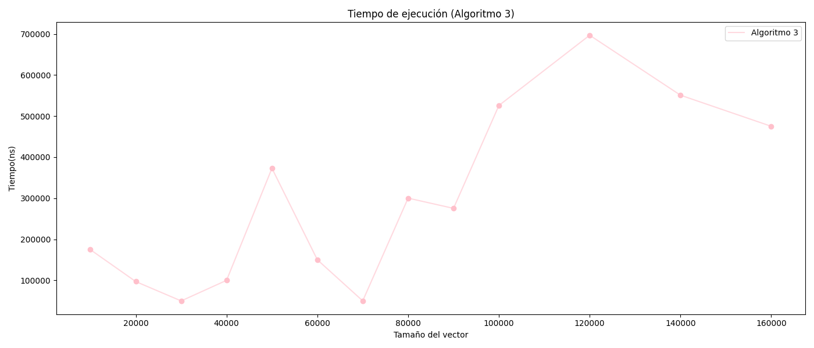

# Objetivo

El objetivo de esta práctica es comparar la eficiencia, en caso promedio de los 3 algoritmos de ordenamiento dados, y a
partir de los resultados
obtenidos
empiricamente, se busca determinar una curva de ajuste que nos permita obtener su eficiencia, y por último, seleccionar
el algoritmo más eficiente.

# Práctica

Para llevar a cabo esta práctica, se ha desarrollado un programa que registra las operaciones elementales, como
comparaciones y asignaciones, así como el promedio de ambas y los tiempos de ejecución de los algoritmos de
ordenamiento.

El programa genera vectores de tamaño variable (n), comenzando con 10,000 elementos y aumentando en intervalos de 10,000
hasta alcanzar 100,000 elementos. Posteriormente, los incrementos son de 20,000 elementos hasta un máximo de 160,000.
Antes de cada proceso de ordenamiento, los vectores son desordenados utilizando el algoritmo de Fisher-Yates.

Para cada tamaño de vector, se realizan 20 pruebas por cada algoritmo. Al final de las pruebas se calcula el
promedio de las métricas mencionadas anteriormente.

Los resultados se almacenan en un archivo `Result.csv`, el cual se utilizará para un análisis detallado mediante
herramientas como Microsoft Excel, GeoGebra y Python.

# Resultados

Los resultados obtenidos son los siguientes:

| Tamaño del vector | Comparaciones | Asignaciones | Media       | Tiempo medio(ns) | Algoritmo   |
|-------------------|---------------|--------------|-------------|------------------|-------------|
| 10000             | 25061862      | 75155590     | 50108726    | 25031115         | Algoritmo 1 |
| 10000             | 235389        | 372711       | 304050      | 494415           | Algoritmo 2 |
| 10000             | 9999          | 30011        | 20005       | 174780           | Algoritmo 3 |
| 20000             | 99912420      | 299677264    | 199794842   | 100603475        | Algoritmo 1 |
| 20000             | 510781        | 805259       | 658020      | 1255425          | Algoritmo 2 |
| 20000             | 19999         | 60011        | 40005       | 97090            | Algoritmo 3 |
| 30000             | 225057816     | 675083451    | 450070633   | 220431410        | Algoritmo 1 |
| 30000             | 800687        | 1259628      | 1030157     | 1603310          | Algoritmo 2 |
| 30000             | 29999         | 90011        | 60005       | 50005            | Algoritmo 3 |
| 40000             | 399311931     | 1197815797   | 798563864   | 401544200        | Algoritmo 1 |
| 40000             | 1101494       | 1730461      | 1415977     | 2453980          | Algoritmo 2 |
| 40000             | 39999         | 120010       | 80004       | 100110           | Algoritmo 3 |
| 50000             | 624598741     | 1873646228   | 1249122484  | 608302090        | Algoritmo 1 |
| 50000             | 1409852       | 2212552      | 1811202     | 3084455          | Algoritmo 2 |
| 50000             | 49999         | 150012       | 100005      | 372905           | Algoritmo 3 |
| 60000             | 900053339     | 2699980020   | 1800016679  | 868647725        | Algoritmo 1 |
| 60000             | 1721413       | 2699347      | 2210380     | 3854380          | Algoritmo 2 |
| 60000             | 59999         | 180011       | 120005      | 150235           | Algoritmo 3 |
| 70000             | 1225339490    | 3675808474   | 2450573982  | 1187821450       | Algoritmo 1 |
| 70000             | 2038420       | 3194486      | 2616453     | 4407015          | Algoritmo 2 |
| 70000             | 69999         | 210011       | 140005      | 50145            | Algoritmo 3 |
| 80000             | 1598983654    | 4796710967   | 3197847310  | 1554245805       | Algoritmo 1 |
| 80000             | 2363007       | 3700762      | 3031884     | 5484765          | Algoritmo 2 |
| 80000             | 79999         | 240013       | 160006      | 300275           | Algoritmo 3 |
| 90000             | 2023110235    | 6069060708   | 4046085471  | 1962061685       | Algoritmo 1 |
| 90000             | 2690258       | 4211294      | 3450776     | 6133445          | Algoritmo 2 |
| 90000             | 89999         | 270011       | 180005      | 275360           | Algoritmo 3 |
| 100000            | 2500604611    | 7501513838   | 5001059224  | 2419364825       | Algoritmo 1 |
| 100000            | 3019697       | 4725007      | 3872352     | 6936840          | Algoritmo 2 |
| 100000            | 99999         | 300011       | 200005      | 525815           | Algoritmo 3 |
| 120000            | 3598880467    | 10796281405  | 7197580936  | 3551301365       | Algoritmo 1 |
| 120000            | 3682620       | 5758465      | 4720542     | 8131590          | Algoritmo 2 |
| 120000            | 119999        | 360012       | 240005      | 696910           | Algoritmo 3 |
| 140000            | 4898085693    | 14693837082  | 9795961387  | 4705513290       | Algoritmo 1 |
| 140000            | 4356929       | 6808857      | 5582893     | 9867795          | Algoritmo 2 |
| 140000            | 139999        | 420011       | 280005      | 550945           | Algoritmo 3 |
| 160000            | 6401533192    | 19204119580  | 12802826386 | 6151146470       | Algoritmo 1 |
| 160000            | 5045939       | 7881461      | 6463700     | 11489110         | Algoritmo 2 |
| 160000            | 159999        | 480012       | 320005      | 475200           | Algoritmo 3 |

# Análisis

A partir de los resultados obtenidos, procedemos a realizar un análisis de los algoritmos de ordenamiento.

## Comparaciones

En el caso de las comparaciones, el algoritmo 1 es el que más comparaciones realiza, seguido del algoritmo 2 y por
último el algoritmo 3. Esto se
puede observar en el siguiente gráfico:

Utilizando las curva de ajuste obtenidas, también podemos llegar a la misma conclusión:

.png)

.png)

Por lo cual tenemos ecuaciones de la forma:

- Algoritmo 1: y = 0.25x^2 - 31.52x + 637737.95
- Algoritmo 2: y = 32.17x - 171073.62
- Algoritmo 3: y = x-1

Aplicando la regla de conjuntos de cotas, tenemos que:

- Algoritmo 1: O(0.25n^2 + 31.52n + 637737.95) = O(n^2)
- Algoritmo 2: O(32.17n - 171073.62) = O(32n) = O(n)
- Algoritmo 3: O(n-1) = O(n)

Por lo tanto, se puede concluir que el promedio de operaciones de comparación para el algoritmo 1 pertenece al orden  
**O(n^2)**,
mientras que para el algoritmo 2 y el algoritmo 3 es de orden **O(n)**. Siendo el algoritmo 3 más eficiente que el
segundo por una constante menor :

O(n^2) > O(32n) = O(n) > O(n-1) = O(n).

Siendo el algoritmo 3 el más eficiente en comparaciones.

## Asignaciones

Llegamos a la misma conclusión que en el caso de las comparaciones, el algoritmo 1 es el que más asignaciones realiza,
seguido del algoritmo 2 y por
último el algoritmo 3. Esto se puede observar en el gráfico siguiente:

De la misma forma, con las curvas de ajuste obtenidas podemos llegar a la misma conclusión:

.png)
.png)

- Algoritmo 1: y = 0.75x^2 - 97.55x + 1913217.51 = O(0.75n^2 + 97.55n + 1913217.51) = **O(n^2)**
- Algoritmo 2: y = 50.20x - 256542.86 = O(50.20n - 256542.86) = **O(n)**
- Algoritmo 3: y = 3x + 10.87 = O(3n + 10.87) = **O(n)**

De tal forma que, O(n^2) > O(50.20n) = O(n) > O(3n) = O(n).

Con la misma conclusión que en el caso de las comparaciones, el algoritmo 3 es el más eficiente en asignaciones.

## Promedio de comparaciones y asignaciones

Siendo el promedio de comparaciones y asignaciones la suma de ambas dividido entre 2, podemos llegar a las mismas
conclusiones que en los casos anteriores:

Sea el conjunto de cotas de las comparaciones y asignaciones para cada algoritmo:

- Algoritmo 1: O(n^2) en comparaciones y asignaciones.
- Algoritmo 2: O(n) en comparaciones y asignaciones.
- Algoritmo 3: O(n) en comparaciones y asignaciones.

El promedio de operaciones elementales para cada algoritmo es el siguiente:

- Algoritmo 1: (O(n^2) + O(n^2)) / 2 = O(n^2) / 2 + O(n^2) / 2 = **O(n^2)**
- Algoritmo 2: (O(n) + O(n)) / 2 = O(n) / 2 + O(n) / 2 = **O(n)**
- Algoritmo 3: (O(n) + O(n)) / 2 = O(n) / 2 + O(n) / 2 = **O(n)**

Y teniendo que, las constantes del algoritmo 2 mayores que las del algoritmo 3, se puede concluir que el algoritmo 3 es
el más eficiente en promedio de operaciones elementales, seguido del algoritmo 2 y por último el algoritmo 1.

## Tiempo de ejecución

Para el primer algoritmo, observamos que su gráfica tiende a una curva polinómica cuadrática, y asi lo confirma su
ecuación de la línea de ajuste: `y = 0.24x^2 + 732.16x - 12925459.86`.

Aplicando la regla de conjuntos de cotas, tenemos que: `O(0.24n^2 + 732.16n - 12925459.86) = O(n^2)`.

Por lo tanto, la eficiencia del algoritmo 1 es de orden **O(n^2)**.

En cuanto a la complejidad temporal del algoritmo 2, su rendimiento es notablemente superior al del algoritmo 1, debido
a una menor cantidad de comparaciones y asignaciones realizadas. Esto sugiere que el algoritmo 2 utiliza una estrategia
más eficiente para reducir el número de operaciones necesarias para ordenar los elementos, lo que se ve reflejado en
tiempos de ejecución más cortos.

Inicialmente, se intentó aproximar la complejidad temporal mediante una curva de ajuste de orden `O(n)`, utilizando la
ecuación `y = 73.31x - 454588.87`, la cual mostró resultados razonables en ciertos rangos de datos.

No obstante, un análisis más profundo del algoritmo revela que su eficiencia depende de la selección de una constante
`k` en un proceso de orden `O(n)`. Y posteriormente, el uso de dos bucles anidados descarta la posibilidad
de que su complejidad total sea de orden `O(n)`.

Este hallazgo nos lleva a reconsiderar el ajuste de la curva y buscar una aproximación de complejidad `O(n log n)`, cuya
ecuación es `y = 13.83x * log(x) - 98657.70`. Esta nueva curva de ajuste demuestra ser más precisa, especialmente para
tamaños de vector superiores a 100,000 elementos.

.png)

Su validez se refuerza al comparar los coeficientes de determinación de ambas curvas:

- R^2 de la curva de ajuste de orden `O(n * log (n))`: **0.9987**
- R^2 de la curva de ajuste de orden `O(n)` lineal: **0.9976**

Dado que el ajuste de la curva `O(n log (n))` es más preciso, se concluye, aplicando la regla de conjunto de cotas, que
la
eficiencia del algoritmo 2 se puede expresar como O(13.83n log(n) - 98657.70), lo cual confirma que su eficiencia es de
orden **O(n log n)**.

En el caso del tercer algoritmo, la dispersión de los datos dificulta la observación de una tendencia clara en la
gráfica obtenida. No obstante, puede apreciarse que la eficiencia del algoritmo presenta una relación positiva con el
tamaño del vector. Para vectores de tamaño inferior a 80,000, la eficiencia mejora considerablemente.

Un analisis detallado del algoritmo revela que su estructura incluye 3 bucles externos `for` desde 0 hasta n, y otro
bucle externo `for` desde 1 hasta una variable `m` seleccionada por el primer bucle `for` (máximo elemento del vector).

Por lo tanto, la eficiencia del algoritmo 3 se descompone en:

- Para el primer bucle `for`: O(n)
- Para el segundo bucle `for`: O(n)
- Para el tercer bucle `for`: O(m)
- Para el cuarto bucle `for`: O(n)

Sumando todas las complejidades, se obtiene un comportamiento de orden O(n + n + m + n) = O(3n + m) = O(n + m).

Con esto, podemos afirmar que la eficiencia del algoritmo 3 es de orden **O(n + m)**, siendo m el máximo elemento del
vector y n el tamaño del vector.

Una aproximación de los datos obtenidos se puede ajustar a la línea de tendencia `y = 3.64x + 22527.42` con un
coeficiente de determinación: R^2 = **0.61630**.

.png)

Finalmente, aplicando el conjunto de cotas, podemos obtener: `O(3.64n + 22527.42)  = O(3n + m) = O(n + m)` , que
afirma nuestra conclusión.

# Conclusión

Con base en los resultados obtenidos, se concluye que el algoritmo más eficiente es el algoritmo 3, seguido del
algoritmo 2, y finalmente el algoritmo 1. Esta clasificación se mantiene tanto en términos de tiempo de ejecución como
en operaciones elementales (comparaciones y asignaciones).

Asimismo, fue posible determinar las curvas de ajuste de eficiencia para los tres algoritmos, aunque la precisión de la
curva para el algoritmo 3 es baja, y su eficiencia está condicionada por el valor de `m`.

# Referencias