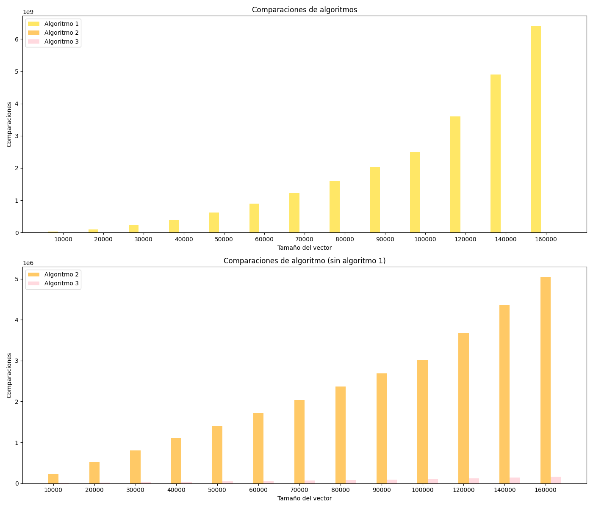

# Objetivo

El objetivo de esta práctica es comparar la eficiencia en caso promedio de los 3 algoritmos de ordenamiento dados, y a partir de los resultados
obtenidos
empiricamente, obtener una curva de ajuste que nos permita obtener su complejidad en caso promedio, y por ultimo, seleccionar el algoritmo más
eficiente.

# Práctica

Para la realización de esta práctica se ha implementado un programa que recoje las operaciones elementales(comparaciones y asignaciones) de los
algoritmos de ordenamiento.
Se ha creado un programa que crea vectores de tamaño n, desde 10000 hasta 100000, con incrementos de 10000, y antes de cada
ordenamiento se desordenarán los vectores mediante el algoritmo de Fisher-Yates.

Para cada tamaño de vector se realizarán 20 pruebas por cada algoritmo, y de cada prueba se obtendrá el número de comparaciones, asignaciones, la
media de ambos y el tiempo de ejecución (ns).

Estos datos se guardarán en un archivo `Result.csv` que se usará como elemento de analisis con Microsoft Excel para obtener la curva de ajuste.

# Resultados

Los resultados obtenidos para cada algoritmo son los siguientes:

## Algoritmo 1

| Tamaño del vector | Comparaciones | Asignaciones | Media      | Tiempo medio(ns) |
|-------------------|---------------|--------------|------------|------------------|
| 10000             | 25007749      | 74993250     | 50000499   | 25526410         |
| 20000             | 100080743     | 300182232    | 200131487  | 95822400         |
| 30000             | 224852642     | 674467929    | 449660285  | 216026365        |
| 40000             | 400424603     | 1201153813   | 800789208  | 385069915        |
| 50000             | 625446779     | 1876190340   | 1250818559 | 599668405        |
| 60000             | 899929569     | 2699608712   | 1799769140 | 860974970        |
| 70000             | 1225250300    | 3675540904   | 2450395602 | 1168187660       |
| 80000             | 1599185971    | 4797317917   | 3198251944 | 1525280345       |
| 90000             | 2023185647    | 6069286946   | 4046236296 | 1912000215       |
| 100000            | 2502738289    | 7507914871   | 5005326580 | 2361132925       |

## Algoritmo 2

| Tamaño del vector | Comparaciones | Asignaciones | Media   | Tiempo medio(ns) |
|-------------------|---------------|--------------|---------|------------------|
| 10000             | 235368        | 372616       | 303992  | 551125           |
| 20000             | 510805        | 805336       | 658070  | 1427605          |
| 30000             | 800684        | 1259719      | 1030201 | 1929155          |
| 40000             | 1101523       | 1730648      | 1416085 | 2455615          |
| 50000             | 1409818       | 2212469      | 1811143 | 3479565          |
| 60000             | 1721394       | 2699267      | 2210330 | 3863020          |
| 70000             | 2038450       | 3194471      | 2616460 | 4597095          |
| 80000             | 2363032       | 3700789      | 3031910 | 5442270          |
| 90000             | 2690224       | 4211431      | 3450827 | 5826750          |
| 100000            | 3019643       | 4724647      | 3872145 | 6839675          |

## Algoritmo 3

| Tamaño del vector | Comparaciones | Asignaciones | Media  | Tiempo medio(ns) |
|-------------------|---------------|--------------|--------|------------------|
| 10000             | 9999          | 30010        | 20004  | 250575           |
| 20000             | 19999         | 60011        | 40005  | 49985            |
| 30000             | 29999         | 90010        | 60004  | 175260           |
| 40000             | 39999         | 120011       | 80005  | 50040            |
| 50000             | 49999         | 150010       | 100004 | 275205           |
| 60000             | 59999         | 180011       | 120005 | 275950           |
| 70000             | 69999         | 210012       | 140005 | 353860           |
| 80000             | 79999         | 240011       | 160005 | 199760           |
| 90000             | 89999         | 270011       | 180005 | 375090           |
| 100000            | 99999         | 300011       | 200005 | 297460           |

# Análisis

A partir de los resultados obtenidos, procedemos a realizar un análisis de los algoritmos de ordenamiento.

## Comparaciones

En el caso de las comparaciones, el algoritmo 1 es el que más comparaciones realiza, seguido del algoritmo 2 y por último el algoritmo 3. Esto se
puede observar en el siguiente gráfico:

Debido al alto número de comparaciones del algoritmo 1, el gráfico no es muy claro, por lo que se ha realizado otro gráfico sin el algoritmo 1:

.png)

Utilizando las curva de ajuste obtenida en Microsoft Excel, también podemos llegar a la misma conclusión:

.png)

.png)

Por lo cual tenemos ecuaciones de la forma:

- Algoritmo 1: y = 0.2504x^2 + 39.298x + 749063
- Algoritmo 2: y = 31.06x - 119189
- Algoritmo 3: y = x-1

Aplicando la regla de conjuntos de cotas, tenemos que:

- Algoritmo 1: O(0.2504n^2 + 39.298n + 749063) = O(n^2)
- Algoritmo 2: O(31.06n - 119189) = O(31n) = O(n)
- Algoritmo 3: O(n-1) = O(n)

Por lo que tenemos que en el caso de las comparaciones, el algoritmo 1 pertenece a **O(n^2)**, el algoritmo 2 a **O(n)** y el algoritmo 3 a **O(n)**.

De tal forma que, O(n^2) > O(31n) = O(n) > O(n-1) = O(n).

Siendo el algoritmo 3 el más eficiente en comparaciones.

## Asignaciones

Llegamos a la misma conclusión que en el caso de las comparaciones, el algoritmo 1 es el que más asignaciones realiza, seguido del algoritmo 2 y por
último el algoritmo 3. Esto se puede observar en los gráficos siguientes:

De la misma forma, con las curvas de ajuste obtenidas en Microsoft Excel, llegamos a la misma conclusión:

- Algoritmo 1: y = 0.7512x^2 + 120.89x + 2e+06 = O(0.7512n^2 + 120.89n + 2e+06) = **O(n^2)**
- Algoritmo 2: y = 48.542x - 178679 = O(48.542n - 178679) = **O(n)**
- Algoritmo 3: y = 3x + 10.2 = O(3n + 10.2) = **O(n)**

De tal forma que, O(n^2) > O(48.542n) = O(n) > O(3n) = O(n).

Con la misma conclusión que en el caso de las comparaciones, el algoritmo 3 es el más eficiente en asignaciones.

## Promedio de comparaciones y asignaciones

Siendo el promedio de comparaciones y asignaciones la suma de ambos dividido entre 2, llegamos a la misma conclusión que en los casos anteriores,
siendo las gráficas:

## Tiempo de ejecución

Se obtiene las gráficas de tiempo de ejecución para cada algoritmo:

Para el primer algoritmo, observamos que los resultados tienden a una secuencia polinómica y así lo confirma excel al calcular la linea de tendencia,
obteniendo una R^2 = 1 con ecuación de la curva de ajuste de la forma: `y = 0.2308x^2 + 611.21 - 7E+06`, y mediante la regla de conjuntos de cotas
podemos obtener lo siguiente: `O(0.2308n^2 + 611.21n - 7E+06)` = **O(n^2)**. Por lo que el algoritmo 1 pertenece a **O(n^2)**.

Para el segundo algoritmo, los resultados crecen de forma lineal más lentamente, pero sin llegar a ser constante, y sospechamos que

# Conclusión